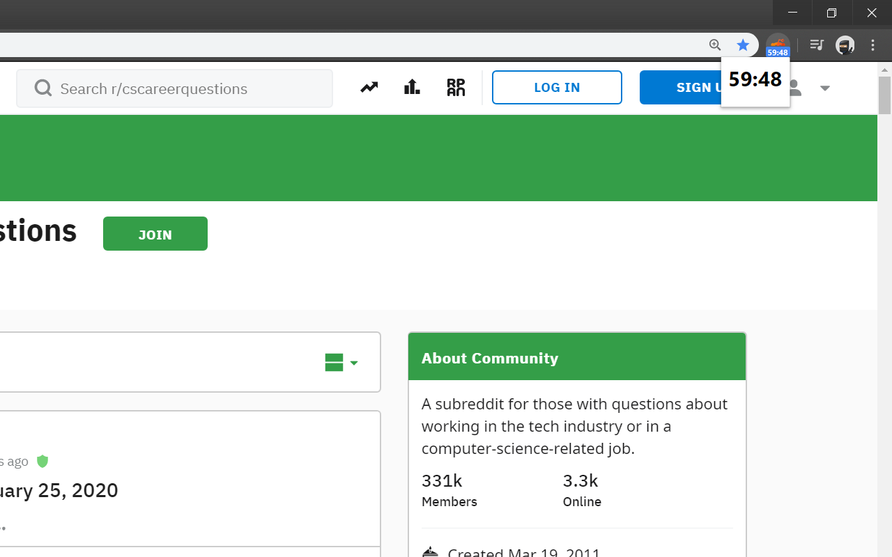
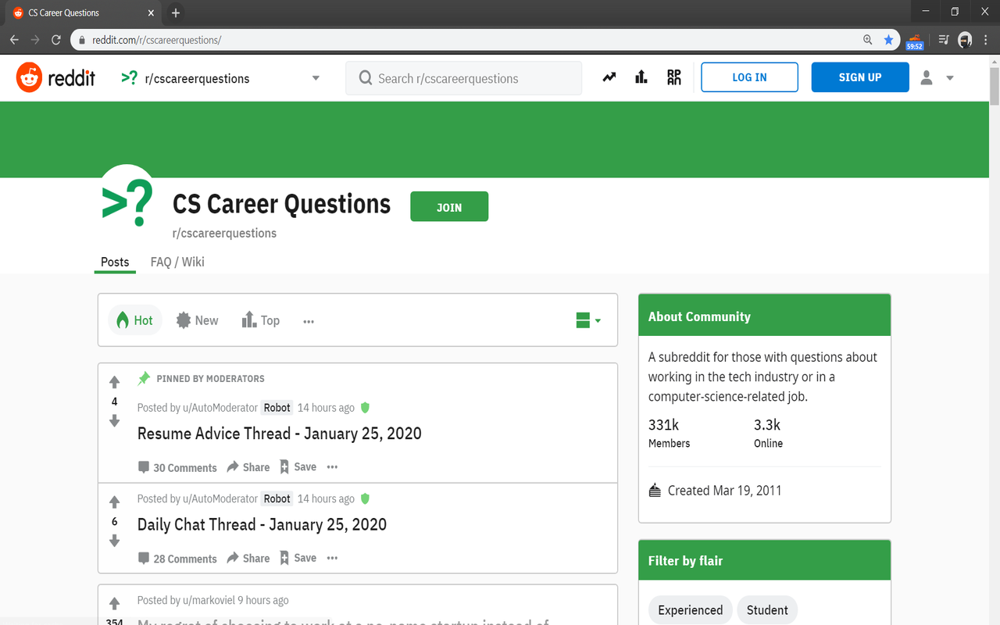
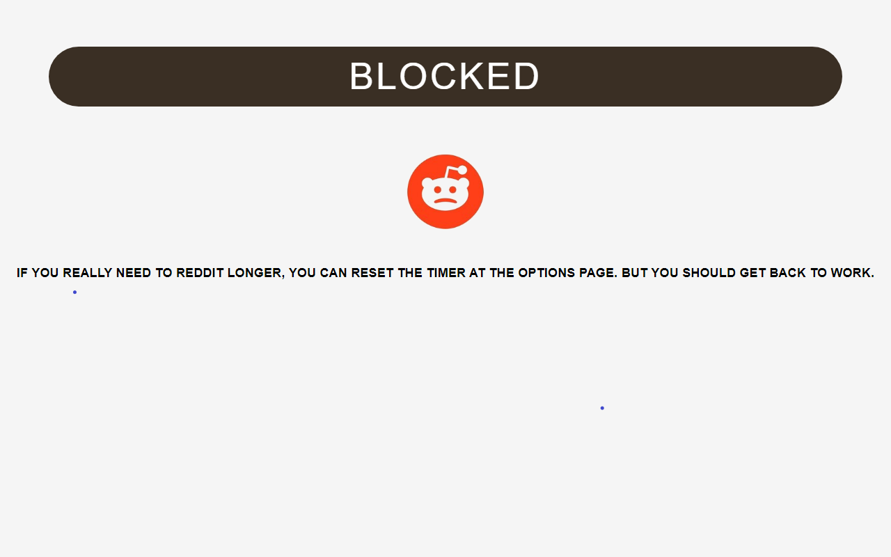
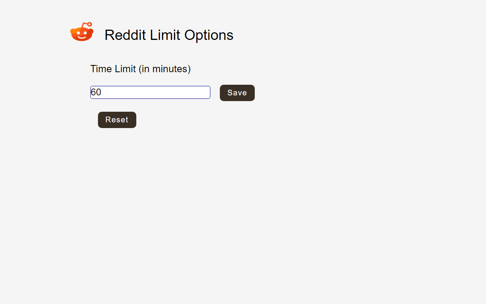

# Reddit-Limit

Reddit-Limit is a chrome extension for productivity through limiting time wasted on reddit.

This extension sets a timer for reddit use and locks you out once timer reaches zero. 
It resets automatically every day, or you can manually set time in options page. 
Maximum time limit of 720 minutes.

## Popup Timer

## Extension Icon Timer 

## Blocked page

## Options Page

